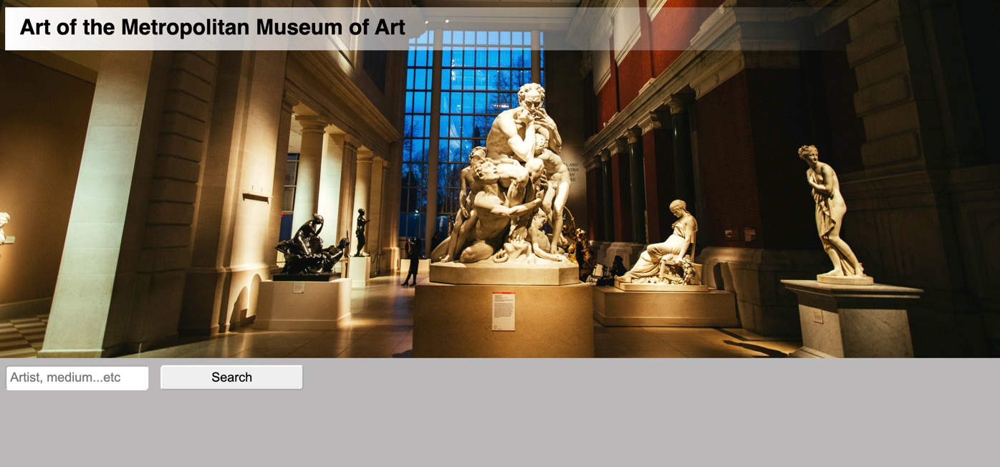
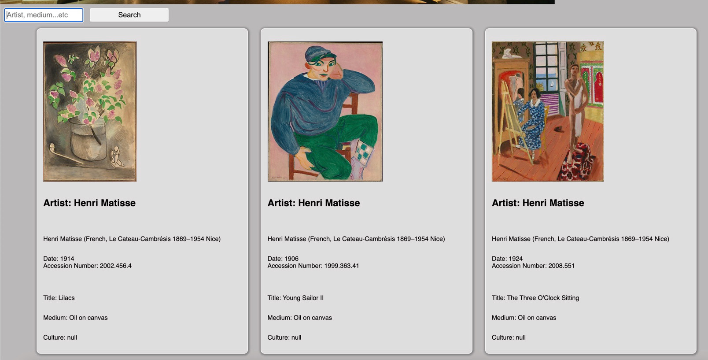

# Art of the Metropolitan Museum of Art

This is a search engine for art through the Metropolitan Museum of Art using an API.

# Technologies Used:

- HTML
- CSS
- Javascript/jQuery

# Screenshots

# Getting Started

Click [https://fervent-edison-ae9da6.netlify.app/] to see the deployed project!

# Future Enhancements

- ability to navigate to multiple pages for results
- make a log of previous searches displayed to viewer
- click on "cards" of results to open in a larger view